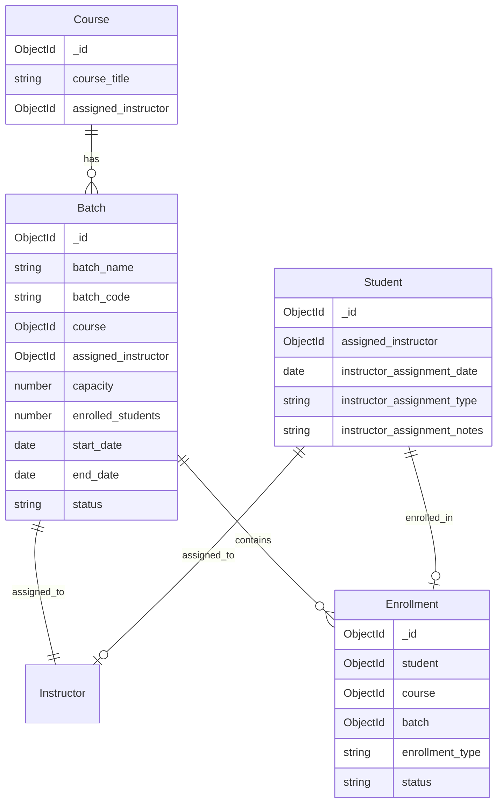
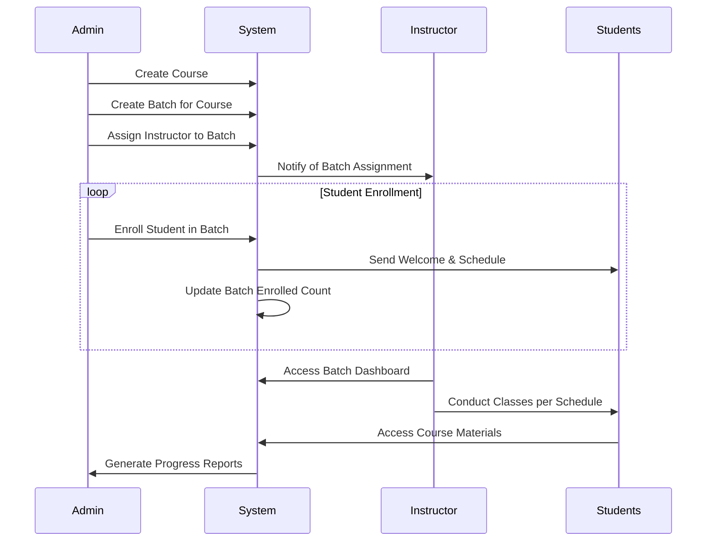
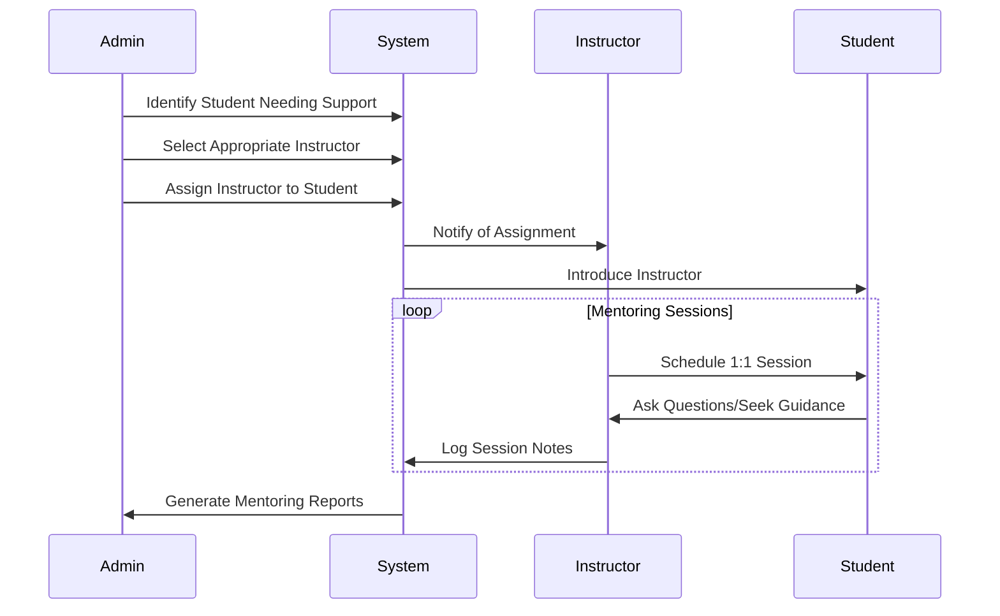
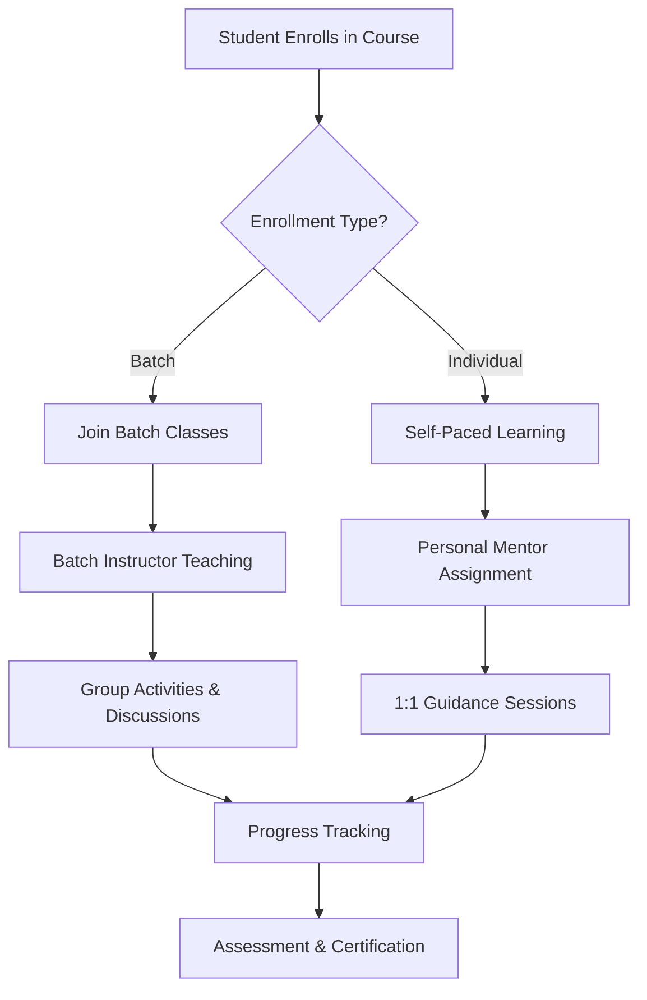

# Batch and Individual Student Allocation to Instructor - Complete Guide

## Table of Contents
1. [Overview](#overview)
2. [System Architecture](#system-architecture)
3. [Data Models](#data-models)
4. [Batch Management](#batch-management)
5. [Individual Student Assignment](#individual-student-assignment)
6. [API Reference](#api-reference)
7. [Workflows](#workflows)
8. [Best Practices](#best-practices)
9. [Troubleshooting](#troubleshooting)
10. [Testing](#testing)

---

## Overview

The Medh Learning Platform supports two types of instructor allocation:

1. **Batch Allocation**: Instructors are assigned to course batches, automatically teaching all students enrolled in that batch
2. **Individual Allocation**: Instructors are directly assigned to individual students for mentoring, tutoring, or guidance

### Key Features
- ✅ Flexible assignment types (mentor, tutor, advisor, supervisor)
- ✅ Batch capacity management with automatic enrollment tracking
- ✅ Comprehensive assignment tracking and audit trails
- ✅ Validation and conflict prevention
- ✅ Statistical reporting and analytics
- ✅ Role-based access control

---

## System Architecture

### Assignment Hierarchy
```
Course
├── Batches (Group Learning)
│   ├── Assigned Instructor (Required)
│   ├── Schedule & Capacity
│   └── Enrolled Students
└── Individual Assignments (Personal Mentoring)
    ├── Student ↔ Instructor (1:1)
    ├── Assignment Type (mentor/tutor/advisor/supervisor)
    └── Assignment Notes & Tracking
```

### Database Relationships


---

## Data Models

### 1. Batch Schema
```javascript
const batchSchema = new Schema({
  batch_name: {
    type: String,
    required: [true, "Batch name is required"],
    trim: true,
  },
  batch_code: {
    type: String,
    unique: true,
    required: [true, "Batch code is required"],
    trim: true,
  },
  course: {
    type: mongoose.Schema.Types.ObjectId,
    ref: "Course",
    required: [true, "Course reference is required for a batch"],
  },
  status: {
    type: String,
    enum: ["Active", "Upcoming", "Completed", "Cancelled"],
    default: "Upcoming",
  },
  start_date: {
    type: Date,
    required: [true, "Batch start date is required"],
  },
  end_date: {
    type: Date,
    required: [true, "Batch end date is required"],
  },
  capacity: {
    type: Number,
    required: [true, "Batch capacity is required"],
    min: [1, "Batch capacity must be at least 1"],
  },
  enrolled_students: {
    type: Number,
    default: 0,
    min: [0, "Enrolled students cannot be negative"],
  },
  assigned_instructor: {
    type: mongoose.Schema.Types.ObjectId,
    ref: "Instructor",
    required: [true, "Instructor assignment is required for a batch"],
  },
  schedule: [{
    day: {
      type: String,
      enum: ["Monday", "Tuesday", "Wednesday", "Thursday", "Friday", "Saturday", "Sunday"],
      required: true,
    },
    start_time: {
      type: String,
      required: true,
      match: /^([01]\d|2[0-3]):([0-5]\d)$/,
    },
    end_time: {
      type: String,
      required: true,
      match: /^([01]\d|2[0-3]):([0-5]\d)$/,
    },
  }],
  batch_notes: String,
  created_by: {
    type: mongoose.Schema.Types.ObjectId,
    ref: "User",
    required: [true, "Creator reference is required"],
  },
}, { timestamps: true });
```

### 2. Individual Assignment Fields (User Schema)
```javascript
// Added to User schema for individual instructor assignments
{
  assigned_instructor: {
    type: mongoose.Schema.Types.ObjectId,
    ref: "User",
    validate: {
      validator: async function(v) {
        if (!v) return true;
        const instructor = await mongoose.model('User').findById(v);
        return instructor && instructor.role.includes('instructor');
      },
      message: 'Assigned instructor must have instructor role'
    }
  },
  instructor_assignment_date: Date,
  instructor_assignment_type: {
    type: String,
    enum: ["mentor", "tutor", "advisor", "supervisor"],
    default: "mentor",
  },
  instructor_assignment_notes: String,
}
```

### 3. Enrollment Schema
```javascript
const enrollmentSchema = new Schema({
  student: {
    type: mongoose.Schema.Types.ObjectId,
    ref: "User",
    required: true
  },
  course: {
    type: mongoose.Schema.Types.ObjectId,
    ref: "Course", 
    required: true
  },
  batch: {
    type: mongoose.Schema.Types.ObjectId,
    ref: "Batch",
    default: null // null for individual enrollments
  },
  enrollment_type: {
    type: String,
    enum: ["individual", "batch", "corporate", "group", "scholarship", "trial"],
    default: "individual",
    required: true
  },
  status: {
    type: String,
    enum: ["active", "completed", "cancelled", "on_hold", "expired"],
    default: "active"
  },
  // ... other fields
});
```

---

## Batch Management

### 1. Creating a Batch

#### API Endpoint
```http
POST /api/batches/courses/:courseId/batches
Authorization: Bearer <admin_token>
Content-Type: application/json
```

#### Request Body
```json
{
  "batch_name": "Morning Batch - January 2025",
  "batch_code": "MORNING-JAN-2025", // Optional - auto-generated if not provided
  "start_date": "2025-01-15T00:00:00.000Z",
  "end_date": "2025-04-15T00:00:00.000Z",
  "capacity": 10,
  "assigned_instructor": "64a7b8c9d1e2f3g4h5i6j7k8",
  "status": "Active",
  "batch_notes": "Morning batch for working professionals",
  "schedule": [
    {
      "day": "Monday",
      "start_time": "08:00",
      "end_time": "10:00"
    },
    {
      "day": "Wednesday",
      "start_time": "08:00", 
      "end_time": "10:00"
    },
    {
      "day": "Friday",
      "start_time": "08:00",
      "end_time": "10:00"
    }
  ]
}
```

#### Response
```json
{
  "success": true,
  "message": "Batch created successfully",
  "data": {
    "_id": "64a7b8c9d1e2f3g4h5i6j7k9",
    "batch_name": "Morning Batch - January 2025",
    "batch_code": "MORNING-JAN-2025",
    "course": "64a7b8c9d1e2f3g4h5i6j7k0",
    "status": "Active",
    "start_date": "2025-01-15T00:00:00.000Z",
    "end_date": "2025-04-15T00:00:00.000Z",
    "capacity": 10,
    "enrolled_students": 0,
    "assigned_instructor": {
      "_id": "64a7b8c9d1e2f3g4h5i6j7k8",
      "full_name": "Dr. John Smith",
      "email": "john.smith@example.com"
    },
    "schedule": [...],
    "createdAt": "2024-01-07T10:30:00.000Z"
  }
}
```

### 2. Assigning Instructor to Batch

#### API Endpoint
```http
PUT /api/batches/:batchId/assign-instructor/:instructorId
Authorization: Bearer <admin_token>
```

#### Response
```json
{
  "success": true,
  "message": "Instructor assigned to batch successfully",
  "data": {
    "_id": "64a7b8c9d1e2f3g4h5i6j7k9",
    "batch_name": "Morning Batch - January 2025",
    "assigned_instructor": "64a7b8c9d1e2f3g4h5i6j7k8",
    "updatedAt": "2024-01-07T11:00:00.000Z"
  }
}
```

### 3. Getting Batches for a Course

#### API Endpoint
```http
GET /api/batches/courses/:courseId/batches
Authorization: Bearer <token>
```

#### Response
```json
{
  "success": true,
  "count": 2,
  "data": [
    {
      "_id": "64a7b8c9d1e2f3g4h5i6j7k9",
      "batch_name": "Morning Batch - January 2025",
      "batch_code": "MORNING-JAN-2025", 
      "status": "Active",
      "start_date": "2025-01-15T00:00:00.000Z",
      "end_date": "2025-04-15T00:00:00.000Z",
      "capacity": 10,
      "enrolled_students": 3,
      "available_spots": 7,
      "assigned_instructor": {
        "_id": "64a7b8c9d1e2f3g4h5i6j7k8",
        "full_name": "Dr. John Smith",
        "email": "john.smith@example.com"
      },
      "schedule": [...]
    }
  ]
}
```

### 4. Enrolling Students in Batch

#### API Endpoint  
```http
POST /api/enrollments/students/:studentId/enroll
Authorization: Bearer <token>
Content-Type: application/json
```

#### Request Body
```json
{
  "courseId": "64a7b8c9d1e2f3g4h5i6j7k0",
  "batchId": "64a7b8c9d1e2f3g4h5i6j7k9",
  "enrollment_type": "batch",
  "enrollment_source": "website",
  "paymentDetails": {
    "amount": 299.99,
    "currency": "USD",
    "payment_method": "credit_card",
    "payment_status": "completed",
    "transaction_id": "txn_123456789"
  }
}
```

#### Response
```json
{
  "success": true,
  "message": "Student enrolled in batch successfully",
  "data": {
    "_id": "64a7b8c9d1e2f3g4h5i6j7k2",
    "student": "64a7b8c9d1e2f3g4h5i6j7k1",
    "course": "64a7b8c9d1e2f3g4h5i6j7k0",
    "batch": "64a7b8c9d1e2f3g4h5i6j7k9",
    "enrollment_type": "batch",
    "status": "active",
    "enrollment_date": "2024-01-07T10:30:00.000Z",
    "access_expiry_date": "2025-05-15T00:00:00.000Z"
  }
}
```

---

## Individual Student Assignment

### 1. Assigning Instructor to Student

#### API Endpoint
```http
POST /api/v1/auth/assign-instructor-to-student
Authorization: Bearer <admin_token>
Content-Type: application/json
```

#### Request Body
```json
{
  "instructor_id": "64a7b8c9d1e2f3g4h5i6j7k8",
  "student_id": "64a7b8c9d1e2f3g4h5i6j7k1", 
  "assignment_type": "mentor",
  "notes": "Focus on programming fundamentals and career guidance"
}
```

#### Assignment Types
- **mentor**: General guidance and career advice
- **tutor**: Subject-specific teaching support
- **advisor**: Academic and course planning guidance  
- **supervisor**: Project and assignment oversight

#### Response
```json
{
  "success": true,
  "message": "Instructor assigned to student successfully",
  "data": {
    "student_id": "64a7b8c9d1e2f3g4h5i6j7k1",
    "student_name": "Jane Smith",
    "instructor_id": "64a7b8c9d1e2f3g4h5i6j7k8", 
    "instructor_name": "Dr. John Smith",
    "assignment_type": "mentor",
    "assignment_date": "2024-01-07T10:30:00.000Z",
    "notes": "Focus on programming fundamentals and career guidance"
  }
}
```

### 2. Getting Students Assigned to Instructor

#### API Endpoint
```http
GET /api/v1/auth/instructor-students/:instructor_id
Authorization: Bearer <token>
```

#### Response
```json
{
  "success": true,
  "message": "Students assigned to instructor fetched successfully",
  "data": {
    "instructor": {
      "id": "64a7b8c9d1e2f3g4h5i6j7k8",
      "name": "Dr. John Smith", 
      "email": "john.smith@example.com"
    },
    "assigned_students": [
      {
        "_id": "64a7b8c9d1e2f3g4h5i6j7k1",
        "full_name": "Jane Smith",
        "email": "jane.smith@example.com",
        "role": ["student"],
        "instructor_assignment_date": "2024-01-07T10:30:00.000Z",
        "instructor_assignment_type": "mentor",
        "instructor_assignment_notes": "Focus on programming fundamentals and career guidance"
      }
    ],
    "total_students": 1
  }
}
```

### 3. Unassigning Instructor from Student

#### API Endpoint
```http
DELETE /api/v1/auth/unassign-instructor-from-student/:student_id
Authorization: Bearer <admin_token>
```

#### Response
```json
{
  "success": true,
  "message": "Instructor unassigned from student successfully",
  "data": {
    "student_id": "64a7b8c9d1e2f3g4h5i6j7k1",
    "student_name": "Jane Smith",
    "previous_instructor": {
      "id": "64a7b8c9d1e2f3g4h5i6j7k8",
      "name": "Dr. John Smith",
      "email": "john.smith@example.com"
    }
  }
}
```

---

## API Reference

### Batch Management APIs

| Method | Endpoint | Description | Access |
|--------|----------|-------------|---------|
| POST | `/api/batches/courses/:courseId/batches` | Create a new batch | Admin |
| GET | `/api/batches/courses/:courseId/batches` | Get all batches for a course | Admin, Instructor |
| GET | `/api/batches/:batchId` | Get batch details | Admin, Instructor, Students |
| PUT | `/api/batches/:batchId` | Update batch details | Admin |
| DELETE | `/api/batches/:batchId` | Delete a batch | Admin |
| PUT | `/api/batches/:batchId/assign-instructor/:instructorId` | Assign instructor to batch | Admin |
| GET | `/api/batches/:batchId/students` | Get students in a batch | Admin, Instructor |

### Individual Assignment APIs

| Method | Endpoint | Description | Access |
|--------|----------|-------------|---------|
| POST | `/api/v1/auth/assign-instructor-to-student` | Assign instructor to student | Admin |
| GET | `/api/v1/auth/instructor-students/:instructor_id` | Get students assigned to instructor | Admin, Instructor |
| DELETE | `/api/v1/auth/unassign-instructor-from-student/:student_id` | Unassign instructor from student | Admin |
| GET | `/api/v1/auth/get-all-students-with-instructors` | Get all students with instructor info | Admin |

### Enrollment APIs

| Method | Endpoint | Description | Access |
|--------|----------|-------------|---------|
| POST | `/api/enrollments/students/:studentId/enroll` | Enroll student in course/batch | Admin, Self |
| GET | `/api/enrollments/:enrollmentId` | Get enrollment details | Admin, Instructor, Student |
| PUT | `/api/enrollments/:enrollmentId` | Update enrollment | Admin |
| DELETE | `/api/enrollments/:enrollmentId` | Cancel enrollment | Admin, Self |

---

## Workflows

### 1. Batch-Based Learning Workflow



### 2. Individual Mentoring Workflow



### 3. Hybrid Learning Workflow



---

## Best Practices

### 1. Batch Management

#### Capacity Planning
- **Optimal Batch Size**: 8-15 students for interactive learning
- **Buffer Capacity**: Always reserve 10-20% capacity for last-minute enrollments
- **Instructor Workload**: Maximum 3-4 active batches per instructor

#### Scheduling
```javascript
// Example optimal schedule for batch
const optimalSchedule = {
  frequency: "3 times per week",
  duration: "2 hours per session", 
  timing: ["Morning (8-10 AM)", "Evening (6-8 PM)"],
  days: ["Monday", "Wednesday", "Friday"] // Non-consecutive days
};
```

#### Batch Lifecycle Management
1. **Planning Phase**: Course design, instructor assignment, capacity setting
2. **Enrollment Phase**: Student registration, payment processing, communication
3. **Active Phase**: Class conduct, progress tracking, engagement monitoring
4. **Completion Phase**: Assessment, certification, feedback collection

### 2. Individual Assignment

#### Assignment Criteria
- **Skill Matching**: Align instructor expertise with student needs
- **Availability**: Ensure instructor has bandwidth for quality mentoring
- **Learning Style**: Match teaching approach with student preferences
- **Language & Culture**: Consider communication comfort

#### Mentoring Guidelines
```javascript
const mentoringBestPractices = {
  frequency: "Weekly 30-60 minute sessions",
  goals: "Clear, measurable learning objectives",
  communication: "Multiple channels (video, chat, email)",
  tracking: "Document progress and key discussions",
  duration: "3-6 months typical assignment period"
};
```

### 3. Quality Assurance

#### Instructor Performance Metrics
- Student satisfaction ratings
- Learning outcome achievements  
- Session attendance rates
- Response time to student queries
- Engagement level in discussions

#### Student Progress Monitoring
- Regular check-ins and assessments
- Early identification of struggling students
- Proactive intervention strategies
- Success milestone celebrations

---

## Troubleshooting

### Common Issues and Solutions

#### 1. Batch Capacity Exceeded
**Problem**: Trying to enroll student in full batch
```javascript
// Error Response
{
  "success": false,
  "message": "Batch has reached maximum capacity"
}
```

**Solution**: 
- Check available batches: `GET /api/batches/courses/:courseId/batches`
- Create new batch if needed
- Increase existing batch capacity (if appropriate)

#### 2. Instructor Already Assigned
**Problem**: Assigning instructor who is already assigned to student
```javascript
// Error Response  
{
  "success": false,
  "message": "This instructor is already assigned to this student"
}
```

**Solution**:
- Check current assignments: `GET /api/v1/auth/instructor-students/:instructor_id`
- Unassign existing instructor first
- Consider workload before reassignment

#### 3. Invalid Instructor Role
**Problem**: Trying to assign user without instructor role
```javascript
// Error Response
{
  "success": false, 
  "message": "Assigned instructor must have instructor role"
}
```

**Solution**:
- Verify user role: `GET /api/users/:userId`
- Update user role to include "instructor"
- Ensure proper permissions are granted

#### 4. Schedule Conflicts
**Problem**: Overlapping batch schedules for instructor
```javascript
// Prevention Strategy
const checkScheduleConflict = async (instructorId, newSchedule) => {
  const existingBatches = await Batch.find({ 
    assigned_instructor: instructorId,
    status: { $in: ['Active', 'Upcoming'] }
  });
  
  // Check for time conflicts
  return existingBatches.some(batch => 
    hasTimeConflict(batch.schedule, newSchedule)
  );
};
```

**Solution**:
- Implement schedule conflict checking
- Suggest alternative time slots
- Allow instructor to manage their availability

### 5. Data Consistency Issues

#### Enrollment Count Mismatch
```javascript
// Fix enrollment count
const fixEnrollmentCount = async (batchId) => {
  const actualCount = await Enrollment.countDocuments({ 
    batch: batchId, 
    status: 'active' 
  });
  
  await Batch.findByIdAndUpdate(batchId, { 
    enrolled_students: actualCount 
  });
};
```

#### Orphaned Assignments
```javascript
// Clean up orphaned assignments
const cleanupOrphanedAssignments = async () => {
  // Remove assignments where instructor or student no longer exists
  await User.updateMany(
    { 
      assigned_instructor: { $exists: true },
      $expr: { 
        $not: { 
          $in: ['$assigned_instructor', await User.find({ role: 'instructor' }).distinct('_id')] 
        } 
      }
    },
    { $unset: { assigned_instructor: 1, instructor_assignment_date: 1 } }
  );
};
```

---

## Testing

### 1. Test Scenarios

#### Batch Management Tests
```javascript
describe('Batch Management', () => {
  test('Create batch with valid data', async () => {
    const batchData = {
      batch_name: "Test Batch",
      start_date: "2025-01-15",
      end_date: "2025-04-15", 
      capacity: 10,
      assigned_instructor: instructorId
    };
    
    const response = await request(app)
      .post(`/api/batches/courses/${courseId}/batches`)
      .set('Authorization', `Bearer ${adminToken}`)
      .send(batchData)
      .expect(201);
      
    expect(response.body.success).toBe(true);
    expect(response.body.data.batch_name).toBe("Test Batch");
  });
  
  test('Prevent enrollment in full batch', async () => {
    // Fill batch to capacity first
    // Then try to enroll one more student
    const response = await request(app)
      .post(`/api/enrollments/students/${studentId}/enroll`)
      .send({ courseId, batchId })
      .expect(400);
      
    expect(response.body.message).toContain("maximum capacity");
  });
});
```

#### Individual Assignment Tests
```javascript
describe('Individual Assignment', () => {
  test('Assign instructor to student', async () => {
    const assignmentData = {
      instructor_id: instructorId,
      student_id: studentId,
      assignment_type: "mentor",
      notes: "Test assignment"
    };
    
    const response = await request(app)
      .post('/api/v1/auth/assign-instructor-to-student')
      .set('Authorization', `Bearer ${adminToken}`)
      .send(assignmentData)
      .expect(200);
      
    expect(response.body.success).toBe(true);
    expect(response.body.data.assignment_type).toBe("mentor");
  });
  
  test('Prevent duplicate assignment', async () => {
    // Try to assign same instructor again
    const response = await request(app)
      .post('/api/v1/auth/assign-instructor-to-student')
      .send({ instructor_id: instructorId, student_id: studentId })
      .expect(400);
      
    expect(response.body.message).toContain("already assigned");
  });
});
```

### 2. Performance Tests

#### Load Testing
```javascript
describe('Performance Tests', () => {
  test('Handle 100 concurrent batch enrollments', async () => {
    const promises = Array.from({ length: 100 }, (_, i) => 
      request(app)
        .post(`/api/enrollments/students/${studentIds[i]}/enroll`)
        .send({ courseId, batchId })
    );
    
    const results = await Promise.all(promises);
    const successCount = results.filter(r => r.status === 201).length;
    
    expect(successCount).toBeLessThanOrEqual(batchCapacity);
  });
});
```

### 3. Integration Tests

#### End-to-End Workflow
```javascript
describe('E2E Workflow', () => {
  test('Complete batch learning flow', async () => {
    // 1. Create course
    const course = await createTestCourse();
    
    // 2. Create batch  
    const batch = await createTestBatch(course._id);
    
    // 3. Assign instructor
    await assignInstructorToBatch(batch._id, instructorId);
    
    // 4. Enroll students
    const enrollments = await Promise.all(
      studentIds.map(id => enrollStudentInBatch(id, course._id, batch._id))
    );
    
    // 5. Verify final state
    const finalBatch = await Batch.findById(batch._id);
    expect(finalBatch.enrolled_students).toBe(studentIds.length);
  });
});
```

### 4. Test Data Management

#### Test Data Factory
```javascript
const TestDataFactory = {
  createInstructor: () => ({
    full_name: "Test Instructor",
    email: `instructor_${Date.now()}@test.com`,
    role: ["instructor"],
    domain: "Computer Science"
  }),
  
  createStudent: () => ({
    full_name: "Test Student", 
    email: `student_${Date.now()}@test.com`,
    role: ["student"]
  }),
  
  createBatch: (courseId, instructorId) => ({
    batch_name: `Test Batch ${Date.now()}`,
    start_date: new Date(Date.now() + 86400000), // Tomorrow
    end_date: new Date(Date.now() + 86400000 * 90), // 90 days
    capacity: 10,
    assigned_instructor: instructorId,
    status: "Active"
  })
};
```

---

## Monitoring and Analytics

### 1. Key Metrics

#### Batch Performance
- Enrollment rate per batch
- Completion rate per batch  
- Student satisfaction scores
- Instructor utilization rate

#### Individual Assignment Effectiveness
- Student progress improvement
- Engagement frequency
- Issue resolution time
- Assignment duration

### 2. Dashboard Queries

#### Instructor Workload Analysis
```javascript
const getInstructorWorkload = async (instructorId) => {
  const [batchCount, individualCount, totalStudents] = await Promise.all([
    Batch.countDocuments({ 
      assigned_instructor: instructorId, 
      status: { $in: ['Active', 'Upcoming'] } 
    }),
    User.countDocuments({ 
      assigned_instructor: instructorId,
      role: { $in: ['student', 'coorporate-student'] }
    }),
    Enrollment.countDocuments({
      batch: { $in: await Batch.find({ assigned_instructor: instructorId }).distinct('_id') },
      status: 'active'
    })
  ]);
  
  return { batchCount, individualCount, totalStudents };
};
```

#### Student Distribution Analysis
```javascript
const getStudentDistribution = async () => {
  const distribution = await User.aggregate([
    { $match: { role: { $in: ['student', 'coorporate-student'] } } },
    {
      $group: {
        _id: {
          hasInstructor: { $cond: [{ $ifNull: ['$assigned_instructor', false] }, 'assigned', 'unassigned'] }
        },
        count: { $sum: 1 }
      }
    }
  ]);
  
  return distribution;
};
```

---

## Conclusion

This comprehensive guide covers all aspects of batch and individual student allocation to instructors in the Medh Learning Platform. The system provides:

- **Flexible Learning Models**: Support for both group and individual learning
- **Robust Assignment Management**: Comprehensive tracking and validation
- **Scalable Architecture**: Designed to handle large numbers of students and instructors
- **Quality Assurance**: Built-in monitoring and analytics capabilities

For additional support or questions, refer to the API documentation or contact the development team. 