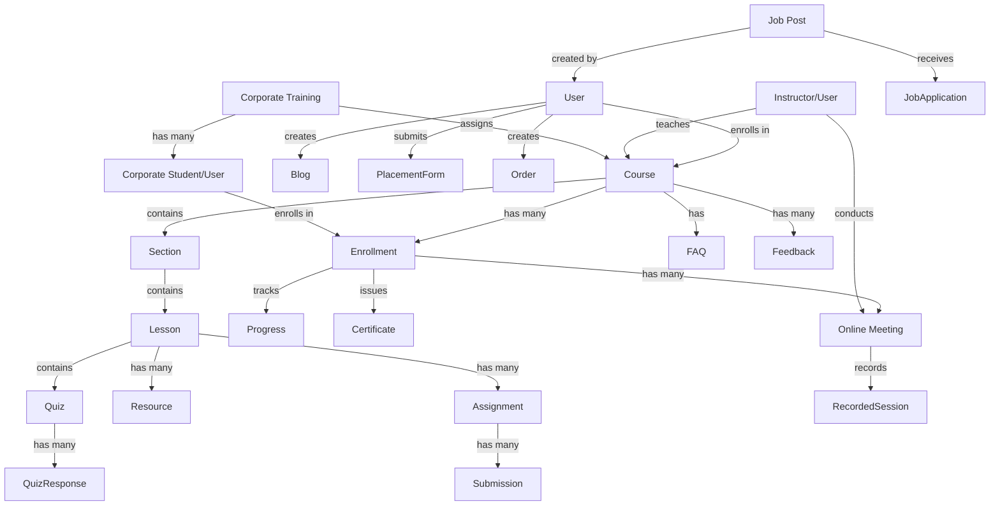
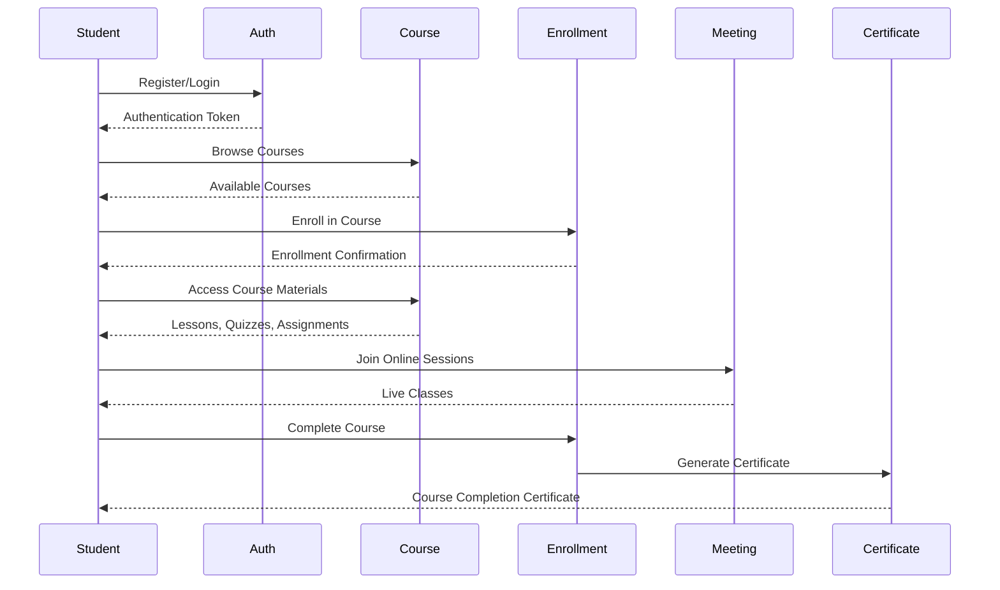
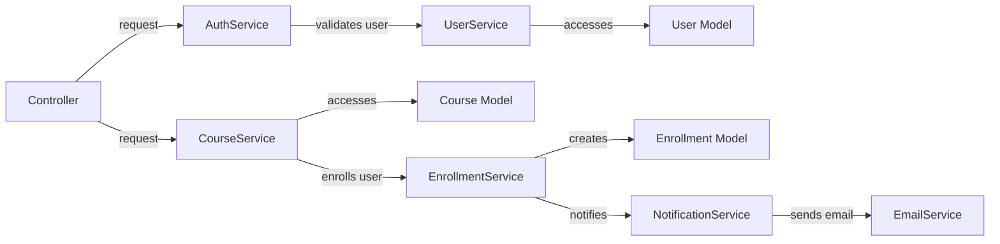

# Model Relationships and User Flow Documentation

## Core Models and Their Relationships

This document outlines the connections between different models in the MEDH backend application. Understanding these relationships is crucial for developing new features and maintaining the existing codebase.

## User Flow Diagram

This diagram demonstrates how users interact with different models throughout their journey in the application:

## Core Model Details

### User Model

- Connected to: Enrollment, Blog, PlacementForm, Order, Job
- Key fields:
  - `_id`: Unique identifier
  - `full_name`: User's full name
  - `email`: Email address (unique)
  - `password`: Hashed password
  - `role`: Array of roles (student, instructor, admin, corporate, corporate-student)
  - `permissions`: Array of permissions for admin users
  - `status`: Active or Inactive

### Course Model

- Connected to: Lesson, Enrollment, FAQ, Feedback, Section
- Key fields:
  - `_id`: Unique identifier
  - `title`: Course title
  - `description`: Course description
  - `price`: Course price
  - `instructor`: Reference to User model
  - `sections`: Array of course sections
  - `status`: Published, Draft, or Archived
  - `category`: Reference to Category model
  - `rating`: Average rating from feedback

### Enrollment Model

- Connected to: User, Course, Progress, Certificate, Meeting
- Key fields:
  - `_id`: Unique identifier
  - `user`: Reference to User model
  - `course`: Reference to Course model
  - `enrolled_date`: Date of enrollment
  - `status`: Active, Completed, or Cancelled
  - `payment_status`: Paid, Pending, or Free

### Lesson Model

- Connected to: Course, Quiz, Resource, Assignment
- Key fields:
  - `_id`: Unique identifier
  - `title`: Lesson title
  - `description`: Lesson description
  - `order`: Sequence in course
  - `type`: Video, Text, Quiz, or Assessment
  - `content`: Lesson content
  - `duration`: Length of lesson in minutes

## Service Layer Integration

The new service layer architecture connects these models more efficiently through:

1. **Specialized Services**: Each service handles specific business logic for a model or group of related models.
2. **Data Transformation**: Services convert between database models and API response formats.
3. **Relationship Management**: Services handle the complexities of model relationships.

Example of service flow:

## Best Practices for Model Interactions

1. **Always use service layer**: Never directly interact with models from controllers.
2. **Validate relationships**: When creating or updating related models, verify that the referenced models exist.
3. **Handle cascading operations**: Consider the impact on related models when performing operations like deletion.
4. **Optimize queries**: Use population strategically to avoid excessive database queries.
5. **Maintain consistency**: Ensure that operations maintain data consistency across related models.

By following these patterns and understanding the model relationships, developers can efficiently build new features and maintain the existing codebase.
